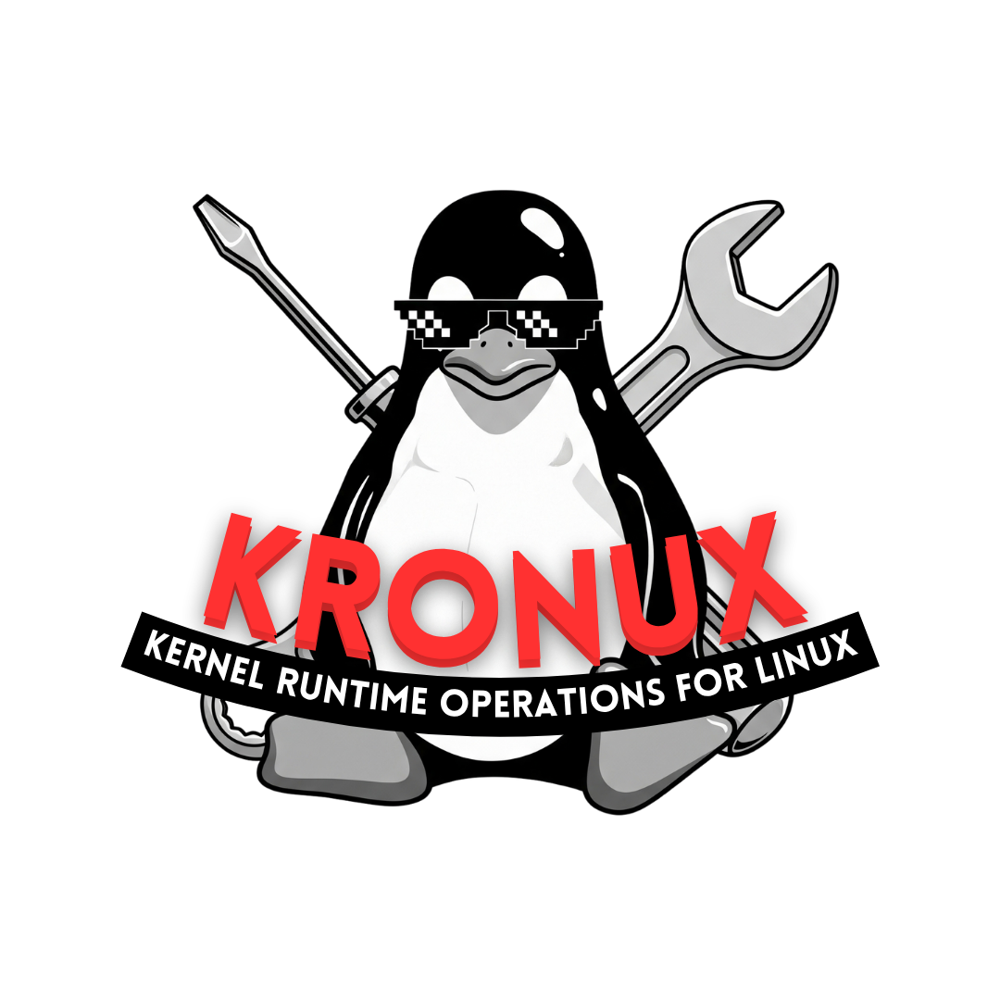
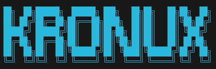
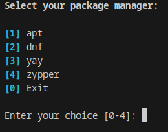
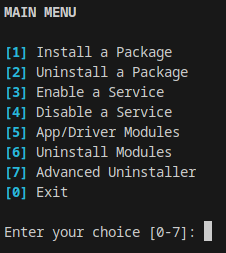

<p align="center">
  
</p>

# KRONUX — Kernel Runtime Operations for Linux

**A full-featured, modular Linux CLI system for installing, uninstalling, and tweaking your system with style and power.**

[](LICENSE)
[]()
[]()
[](https://github.com/maulananais/kronux/stargazers)
[](https://github.com/maulananais/kronux/issues)
[](https://github.com/maulananais/kronux)

## 🚀 Features

- **Standalone & Modular** — Complete 3,800+ line standalone script OR modular architecture
- **Auto Repository Management** — Automatically installs Git and clones repository on first run
- **170+ Applications** — Comprehensive package mappings across all categories
- **CLI-first UX** — Dynamic selection, spinners, and logs
- **App installer & uninstaller** — Toggle packages by number selection
- **Graphics Driver Support** — Automatic hardware detection and driver installation
- **Hardware Acceleration** — Support for VA-API, VDPAU, and multimedia codecs
- **Special Installation Functions** — 17+ custom installers for complex applications
- **Communication Apps** — Discord, Slack, Teams, WhatsApp, Signal, Element, and more
- **Productivity Suite** — Notion, Obsidian, Todoist, Zettlr, Evernote support
- **Clean terminal views** — Clear and focused menus
- **Logging enabled** — `logs/install-log.txt` and `logs/uninstall-log.txt` auto-created
- **Multi-distro support** — `apt`, `dnf`, `yay`, `zypper`
- **Fast back-navigation** — Via `[0] Back` or `back` keyword
- **Advanced uninstaller** — Risk assessment and smart filtering

## 📸 Screenshots / Demo

### ⏳ Loading Screen


### 🖱️ Package Selection


### 🖼️ Main Menu


## 💻 Installation

### 🚀 Standalone Script (Recommended)
```bash
curl -sL https://raw.githubusercontent.com/maulananais/kronux/main/kronux.sh > /tmp/kronux.sh && bash /tmp/kronux.sh
```
**Features of the standalone script:**
- ✅ **Complete 3,800+ line script** — All functionality in one file
- ✅ **Auto Git Installation** — Installs Git if not present
- ✅ **Auto Repository Cloning** — Downloads full repository for documentation and updates
- ✅ **170+ Application Support** — Complete package mappings across all categories
- ✅ **17+ Special Installers** — Custom installation methods for complex applications
- ✅ **Exit Location Display** — Shows repository location when exiting

### 🧩 Clone via Git (Development)
```bash
git clone https://github.com/maulananais/kronux.git
cd kronux
chmod +x main.sh
./main.sh
```

### ☁️ Run Standalone Script (Recommended)
```bash
curl -sL https://raw.githubusercontent.com/maulananais/kronux/main/kronux.sh > /tmp/kronux.sh && bash /tmp/kronux.sh
```
> ✅ **Complete Experience:** The standalone script automatically clones the repository and provides full functionality.

## 🎮 Quick Usage

1. **Run the installation command** above
2. **Select package manager** (auto-detected)
3. **Navigate menus** using numbers (1, 2, 3...)
4. **Multi-select packages** by typing space-separated numbers (e.g., `1 3 5`)
5. **Execute selection** by typing `go`
6. **Go back** by typing `0` or `back`

**Example Session:**
```
[5] App/Driver Modules → [1] Developer Tools → 1 3 5 → go
```
*Installs VS Code, Neovim, and Git*

📚 **Need help?** See [DOCUMENTATION.md](DOCUMENTATION.md) for complete usage guide.

## 🔧 Requirements

- **Any modern Linux distro**
- **Bash v5+**
- **Supported package manager:**
  - `apt` / `dnf` / `yay` / `zypper`
- **sudo privileges**
- **(Optional)** `git` if you want to clone

## 💡 Why KRONUX?

**KRONUX was built to reduce Linux setup fatigue and provide a comprehensive toolkit for any Linux user.**

Whether you're a distrohopper, sysadmin, developer, or daily driver user — you deserve a fast, clean, and repeatable setup flow that covers everything you need.

- ✅ **170+ Applications** — From browsers to development tools to communication apps
- ✅ **One-Command Installation** — `curl -sL https://... > /tmp/kronux.sh && bash /tmp/kronux.sh` and you're done
- ✅ **Auto Repository Management** — Git installation and repository cloning built-in
- ✅ **No fluff, no dependencies, no clutter** — Pure Bash, maximum compatibility
- ✅ **Works offline** (once cloned) — Perfect for air-gapped systems
- ✅ **Clean UI, structured logs, minimal design** — Professional and user-friendly
- ✅ **Cross-Distribution** — Ubuntu, Fedora, Arch, openSUSE, and more
- ✅ **Special Installation Support** — Complex applications like Chrome, VSCode, Discord handled automatically

## 🛡️ Advanced Features

### **Graphics Driver Module**
- **Auto Hardware Detection** — Automatically detects Intel, NVIDIA, and AMD graphics hardware
- **Driver Installation** — Supports proprietary and open-source drivers for all major GPU vendors
- **Hardware Acceleration** — VA-API, VDPAU, and Intel Media Driver support
- **Multi-architecture Support** — 32-bit libraries for gaming and compatibility
- **Repository Setup** — Automatic configuration of required repositories (RPM Fusion, multilib, etc.)
- **Dependency Validation** — Ensures all required tools are available before installation
- **Post-install Guidance** — Clear instructions for system restart and configuration

### **Smart Uninstaller**
- **Automatic Detection** — Scans system for unused applications
- **Risk Assessment** — Categorizes applications by safety level
- **Smart Filtering** — Separates safe, risky, and critical applications
- **Multiple Modes** — Manual selection, clean uninstall, system scan

### **Application Categories (170+ Apps)**
- **Developer Tools (20 apps)** — VS Code, VSCodium, Git, Docker, Node.js, Python, and more
- **Web Browsers (10 apps)** — Chrome, Firefox, Brave, Edge, Opera, Vivaldi, Tor, and more
- **Multimedia Tools (14 apps)** — VLC, GIMP, Blender, OBS Studio, Kdenlive, and more
- **Communication Apps (14 apps)** — Discord, Slack, Teams, WhatsApp, Signal, Element, Zoom, and more
- **System Tools (21 apps)** — htop, btop, neofetch, gparted, timeshift, and more
- **Productivity Apps (18 apps)** — LibreOffice, Notion, Obsidian, Todoist, Zettlr, Evernote, and more
- **Audio Drivers (12 packages)** — ALSA, PulseAudio, PipeWire, JACK, Ardour, and more
- **System Tweaks (12 options)** — TLP, ZRAM, CPU Governor, GRUB timeout, and more
- **System Cleanup (12 tools)** — Cache cleaning, orphaned packages, log files, and more

### **Special Installation Functions (17 Apps)**
Applications with custom installation methods:
- **Browsers:** Google Chrome, Microsoft Edge, Brave Browser
- **Development:** Visual Studio Code, Docker
- **Communication:** Discord, Slack, Zoom, WhatsApp, Teams, Signal, Element
- **Productivity:** Notion
- **Entertainment:** Spotify, Steam
- **System:** Flatpak, Snap

### **Hardware Acceleration Support**
- **Intel GPUs** — Intel Media Driver (new) and VA Driver (legacy) support
- **AMD GPUs** — Mesa VA/VDPAU drivers with freeworld variants (Fedora)
- **NVIDIA GPUs** — VAAPI bridge for hardware acceleration
- **32-bit Support** — Gaming compatibility with Steam and Wine
- **DVD Playback** — libdvdcss installation for encrypted DVD support
- **Firmware Packages** — Additional hardware firmware for optimal compatibility

### **Risk Assessment System**
- **CRITICAL** 🚫 — System essential applications (bash, sudo, systemd)
- **IMPORTANT** ⚠️ — System functionality apps (network-manager, pulseaudio)
- **RISKY** ⚠️ — Dependencies many applications rely on (python3, curl, git)
- **SAFE** ✅ — Applications that can be removed safely

## 📁 Project Structure

```
├── kronux.sh               # 🚀 STANDALONE SCRIPT (3,800+ lines, complete functionality)
├── main.sh                 # Main entry point for modular version
├── config/
│   └── config.sh          # Configuration and global variables
├── lib/
│   └── utils.sh           # Utility functions and common operations
├── modules/
│   ├── package_manager.sh # Package manager detection and mapping
│   ├── actions.sh         # Action handlers (install, uninstall, services)
│   ├── menus.sh          # Menu system and navigation
│   ├── uninstaller.sh    # Advanced uninstaller functionality
│   └── driver.sh         # Graphics driver installation and hardware acceleration
├── logs/
│   ├── install-log.txt   # Installation logs
│   └── uninstall-log.txt # Uninstallation logs
├── assets/               # Images and visual assets
│   ├── kronux.png
│   ├── kronux-ascii.png
│   ├── demo-main_menu.png
│   └── demo-select_pkg.png
└── docs/
    └── ADVANCED_UNINSTALLER.md
```

### 🎯 Standalone vs Modular

**Standalone Script (`kronux.sh`):**
- ✅ Single file with all functionality
- ✅ 3,800+ lines of comprehensive code
- ✅ Auto Git installation and repository cloning
- ✅ 170+ application support with package mappings
- ✅ 17+ special installation functions
- ✅ Perfect for one-command execution

**Modular Version (`main.sh` + modules):**
- ✅ Organized code structure for development
- ✅ Easy to extend and debug
- ✅ Same functionality as standalone
- ✅ Better for contributors and customization

## 🤝 Contributing

Feel free to fork, modify, or submit improvements.
PRs are welcome, especially for new modules or distros.

## 🧾 License

KRONUX is released under the **MIT License**.

## � Documentation

📚 **[Complete Documentation](DOCUMENTATION.md)** — Comprehensive usage guide, troubleshooting, and advanced features

**Quick Links:**
- 🚀 [Installation Methods](DOCUMENTATION.md#-quick-start)
- 🎮 [Usage Guide](DOCUMENTATION.md#-usage-guide) 
- 📦 [Package Management](DOCUMENTATION.md#-package-management)
- 🖥️ [Graphics Drivers](DOCUMENTATION.md#-graphics-drivers)
- 🗑️ [Advanced Uninstaller](DOCUMENTATION.md#-advanced-uninstaller)
- 🔍 [Troubleshooting](DOCUMENTATION.md#-troubleshooting)

---

## �📢 Connect & Support

<p align="center">
  <a href="https://instagram.com/mqulqnqq" target="_blank">
    
  </a>
  <a href="https://linkedin.com/in/maulananais" target="_blank">
    
  </a>
  <a href="https://saweria.co/maulananais" target="_blank">
    
  </a>
</p>

❤️ **Found KRONUX useful?** Consider donating or sharing the project!

---

## ✨ Author

**Made with heart by Maulana Nais.**  
🐧 Linux Enthusiast. CLI Tweaker. Automation Addict.
